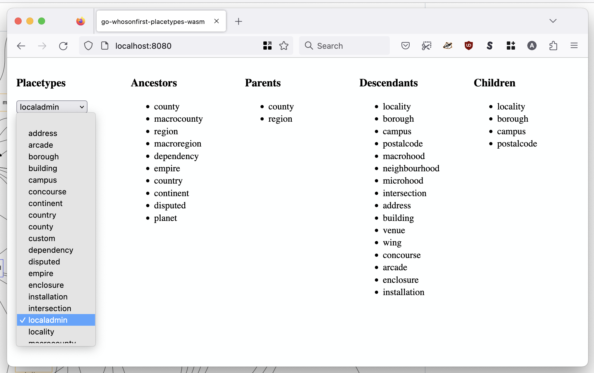
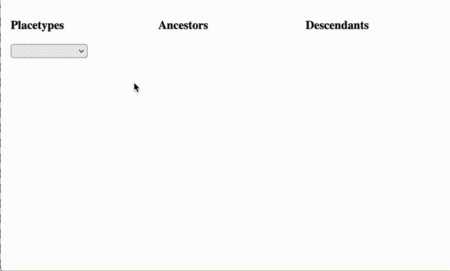

# go-whosonfirst-placetypes-wasm

Go package for compiling methods from the [go-whosonfirst-placetypes](https://github.com/whosonfirst/go-whosonfirst-placetypes) package to a JavaScript-compatible WebAssembly (wasm) binary. It also provides a net/http middleware packages for appending the necessary static assets and HTML resources to use the wasm binary in web applications.

## Build

To build the `validate_feature` WebAssembly binary for use in your applications run the following command:

```
GOOS=js GOARCH=wasm go build -mod vendor -ldflags="-s -w" -o static/wasm/whosonfirst_placetypes.wasm cmd/placetypes/main.go
```

## Use

In order to load the `whosonfirst_placetypes` functions you will need to include the `wasm_exec.js` and `whosonfirst.placetypes.wasm.js` JavaScript files, or functional equivalents. Both scripts are bundled with this package in the [static/javascript](static/javascript) folder.

## Functions

### whosonfirst_placetypes

Return a JSON-encoded list of all valid Who's On First placetypes.

```
	whosonfirst_placetypes()
	    .then((data) => { ... });
```

### whosonfirst_placetypes_ancestors

Return a JSON-encoded list of all the ancestors for a given placetype.

```
	whosonfirst_placetypes_ancestors("region", "common,optional,common_optional")
	    .then((data) => { ... });
```

The second argument (a comma-separated list of placetype roles to filter results by) is optional. If absent then the "common" role will be assumed.

### whosonfirst_placetypes_children

Return a JSON-encoded list of all the children for a given placetype.

```
	whosonfirst_placetypes_children("region")
	    .then((data) => { ... });
```

### whosonfirst_placetypes_descendants

Return a JSON-encoded list of all the descendants for a given placetype.

```
	whosonfirst_placetypes_descendants("region", "common,optional,common_optional")
	    .then((data) => { ... });
```

The second argument (a comma-separated list of placetype roles to filter results by) is optional. If absent then the "common" role will be assumed.

### whosonfirst_placetypes_core

Return success if a placetype is considered to be a "core" Who's On First placetype or throws and error if not.

```
	whosonfirst_placetypes_is_core("region")
	    .then(() => { console.log("Core"); })
	    .catch(() => { console.log("Not core"); });
```

### whosonfirst_placetypes_isvalid

Return success if a placetype is valid or throw an error if not.

```
	whosonfirst_placetypes_is_valid("region")
	    .then(() => { console.log("Valid"); })
	    .catch(() => { console.log("Invalid"); });
```

### whosonfirst_placetypes_parents

Return a JSON-encoded list of all the parent placetypes for a given placetype.

```
	whosonfirst_placetypes_parents("region")
	    .then((data) => { ... });
```

## Middleware

The `go-whosonfirst-validate-wasm/http` package provides methods for appending static assets and HTML resources to existing web applications to facilitate the use of the `validate_feature` WebAssembly binary. For example:

_Note the use of the `sfomuseum/go-http-wasm` package which is an HTTP middleware package for serving and appending resources to the `wasm_exec.js` JavaScript library._

```
package main

import (
	"embed"
	"flag"
	"fmt"
	"log"
	"net/http"

	placetypes_wasm "github.com/whosonfirst/go-whosonfirst-placetypes-wasm/http"
	wasm_exec "github.com/sfomuseum/go-http-wasm"
)

//go:embed index.html example.*
var FS embed.FS

func main() {

	host := flag.String("host", "localhost", "The host name to listen for requests on")
	port := flag.Int("port", 8080, "The host port to listen for requests on")

	flag.Parse()

	mux := http.NewServeMux()

	wasm_exec.AppendAssetHandlers(mux)
	placetypes_wasm.AppendAssetHandlers(mux)

	http_fs := http.FS(FS)
	example_handler := http.FileServer(http_fs)

	mux.Handle("/", example_handler)

	addr := fmt.Sprintf("%s:%d", *host, *port)
	log.Printf("Listening for requests on %s\n", addr)

	http.ListenAndServe(addr, mux)
}

```

_Error handling omitted for brevity._

## Example

There is a full working example of this application in the `cmd/example` folder. To run this application type the following command:

```
$> make example
go run -mod vendor cmd/example/main.go
2023/01/31 15:11:48 Listening for requests on localhost:8080
```

Then open `http://localhost:8080` in a  web browser. You should see something like this:



For example:



## See also

* https://github.com/whosonfirst/go-whosonfirst-placetypes
* https://github.com/sfomuseum/go-http-wasm
* https://github.com/golang/go/wiki/WebAssembly